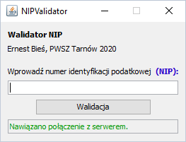
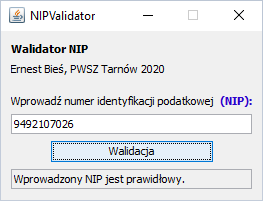
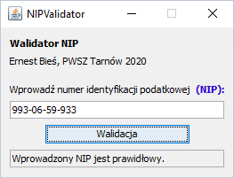
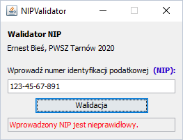
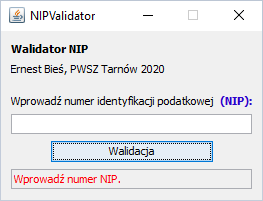
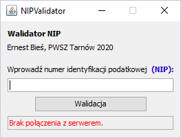
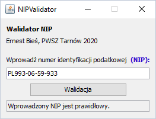
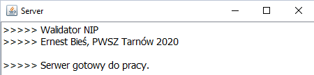
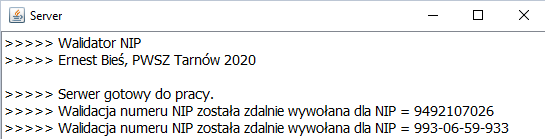
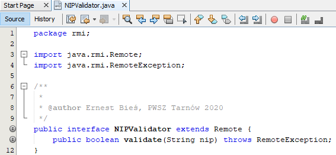

# NIP Validator

The program checks the correctness of the entered tax identification number. After starting the client, the user receives information (in the displayed field) whether the connection with the server has been established. Then the user enters the tax identification number and presses the "Validation" button. The user's screen shows whether the entered NIP number is correct. The program is based on the RMI technology.

# Screenshots

1. Client

2. Server

3. Interface

